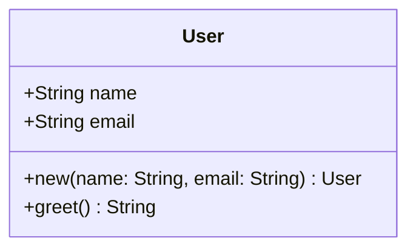

# Auto-UML

An automatic UML diagram generator that uses tree-sitter to parse source code and generate Mermaid class diagrams.

## Features

- **Multi-language support**: Rust, Java, JavaScript, TypeScript, C++, C#
- **Single file analysis**: Generate UML diagrams from individual source files
- **Repository-scale analysis**: Process entire directories and merge diagrams across multiple files
- **Type resolution**: Automatically resolves types across files in multi-file projects
- **Automatic language detection**: Detects the programming language from file extensions

## Installation

```bash
cargo build --release
```

The binary will be at `target/release/auto-uml`.

## Usage

```bash
# Single file mode (language auto-detected)
auto-uml --source-code path/to/file.rs --destination diagram.mmd

# Single file mode with explicit language
auto-uml --lang rust --source-code path/to/file.rs --destination diagram.mmd

# Directory mode (entire repository)
auto-uml --source-code path/to/project --destination diagram.mmd
```

## Supported Languages

| Language    | Extensions        |
|-------------|------------------|
| Rust        | `.rs`            |
| Java        | `.java`          |
| JavaScript  | `.js`            |
| TypeScript  | `.ts`, `.tsx`    |
| C++         | `.cpp`, `.cc`, `.cxx`, `.hpp`, `.h` |
| C#          | `.cs`            |

## Output

The tool generates Mermaid class diagrams. You can render them with:

- [Mermaid Live Editor](https://mermaid.live/)
- VS Code with Mermaid extension
- GitHub Markdown (with mermaid plugin)

## How It Works

1. **Parsing**: Uses tree-sitter to build abstract syntax trees (AST) from source code
2. **Extraction**: Traverses the AST to extract classes, functions, methods, and variables
3. **Stitching**: For multi-file projects, merges diagrams and resolves types across files
4. **Generation**: Outputs Mermaid class diagram format

## Example

Input (Rust):
```rust
struct User {
    name: String,
    email: String,
}

impl User {
    fn new(name: String, email: String) -> User {
        User { name, email }
    }

    fn greet(&self) -> String {
        format!("Hello, {}!", self.name)
    }
}
```

Output (Mermaid):

