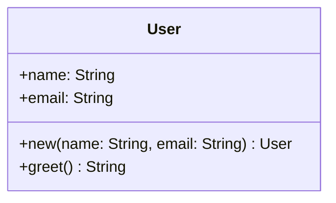

# Auto-UML

<!--toc:start-->
- [Auto-UML](#auto-uml)
  - [Features](#features)
  - [Installation](#installation)
  - [Usage](#usage)
  - [Supported Languages](#supported-languages)
  - [Output](#output)
  - [How It Works](#how-it-works)
  - [Example](#example)
  - [Benchmark](#benchmark)
    - [Test codebases](#test-codebases)
    - [Results](#results)
<!--toc:end-->

A lightning fast automatic UML diagram generator that uses tree-sitter to parse source code and generate Mermaid class diagrams.

## Features

- **Multi-language support**: Rust, Java, JavaScript, TypeScript, C++, C#, Objective-C, and Dart.
- **Single file analysis**: Generate UML diagrams from individual source files.
- **Repository-scale analysis**: Process entire directories and merge diagrams across multiple files.
- **Remote Analysis**: Clone and analyze remote git repositories directly.
- **Type resolution**: Automatically resolves types across files in multi-file projects.
- **Automatic language detection**: Detects the programming language from file extensions.

## Installation

```bash
cargo install auto-uml
```

Or alternatively to build from source.

```bash
cargo install --git https://github.com/EthanDGee/Auto-UML.git
```

## Usage

```bash
# Analyze current directory (auto-detect language)
auto-uml

# Single file mode (language auto-detected)
auto-uml --source-code path/to/file.rs

# Analyze current directory with a specified language
auto-uml --lang <lang> (e.g rust)

# Directory mode (entire repository)
auto-uml --source-code path/to/project

# Remote git repository
auto-uml --git https://github.com/user/repo.git

# Specify destination (defaults to UML.md)
auto-uml --destination my_diagram.md

# Output raw Mermaid (without markdown code block)
auto-uml --no-mermaid
```

### Full Options

| Flag | Description |
|------|-------------|
| `--list-languages` | List available programming languages |
| `-l`, `--lang <LANG>` | Programming language (optional, auto-detected if omitted) |
| `-s`, `--source-code <PATH>` | Path to the local source file or directory (defaults to  current directory) |
| `--git <URL>` | Remote git repository URL to clone and analyze |
| `--no-mermaid` | Outputs raw Mermaid syntax without markdown code blocks |
| `-d`, `--destination <FILE>` | Write destination file [default: UML.md] |

## Supported Languages

| Language    | Extensions        |
|-------------|------------------|
| rust        | `.rs`            |
| java        | `.java`          |
| javascript  | `.js`            |
| typescript  | `.ts`, `.tsx`    |
| cpp         | `.cpp`, `.cc`, `.cxx`, `.hpp`, `.h` |
| csharp      | `.cs`            |
| objective-c | `.m`, `.h`       |
| dart        | `.dart`          |

## Output

The tool generates Mermaid class diagrams. You can render them with:

- [Mermaid Live Editor](https://mermaid.live/)
- VS Code with Mermaid extension
- GitHub

## How It Works

1. **Parsing**: Uses tree-sitter to build abstract syntax trees (AST) from source code.
2. **Extraction**: Traverses the AST to extract classes, functions, methods, and variables using language specific config.
3. **Stitching**: For multi-file projects, merges diagrams and resolves types across files to create one diagram.
4. **Generation**: Outputs into a Mermaid.js class diagram.

## Example

Input (Rust):

```rust
struct User {
    name: String,
    email: String,
}

impl User {
    fn new(name: String, email: String) -> User {
        User { name, email }
    }

    fn greet(&self) -> String {
        format!("Hello, {}!", self.name)
    }
}
```

Output (Mermaid):



## Benchmark

Auto-UML is designed from the ground up to be extremely fast. Since it works with a per-file LR representation that is merged recursively it can also work on extremely large code bases. Most code bases can be done in milliseconds with the larger ones taking seconds. Making it a great addition to your CI/CD pipeline or for personal use.

> **Disclaimer**: All benchmarks were performed on the latest main branch as of March 10, 2026.

### Test code bases

All of the following tests were done using hyperfine with 100 runs.

- This Codebase - As is tradition for many analysis programs it is fitting that this program is used to analyze itself.

- [CoreUtils](https://github.com/uutils/coreutils.git) - A rust rewrite of the GNU core utils. As a result it is a rather large code base made up of 1280 files, 610 being rust with 233,223 lines of code total.

- [Chart.js](https://github.com/chartjs/Chart.js) - A popular JavaScript charting library. Contains approximately 200 JavaScript files totaling around 30,000 lines of code. Tests done using the JavaScript parser.

- [BuildCLI](https://github.com/BuildCLI/BuildCLI) - A Java CLI framework. Contains approximately 150 Java files.

- [faker-cxx](https://github.com/cieslarmichal/faker-cxx) - A C++ fake data generator library. Contains approximately 400 C++ files.

- [authpass](https://github.com/authpass/authpass.git) - A Flutter/Dart password manager. Contains approximately 500 Dart files.

- [jupyterlab](https://github.com/jupyterlab/jupyterlab) - A large TypeScript project. Contains approximately 1,000 TypeScript files.

- [bitwarden-server](https://github.com/bitwarden/server) - A large C# project. Contains approximately 1,500 C# files.

- [Platypus](https://github.com/sveinbjornt/Platypus) - An Objective-C macOS application. Contains approximately 30 Objective-C files.

### Results

| Codebase                                                      | Language      | Mean runtime | Standard Deviation | Min       | Max       |
| ------------------------------------------------------------ | ------------- | ------------ | ------------------ | --------- | --------- |
| [This Codebase](https://github.com/anomalyco/auto-UML)      | Rust          | 36.3 ms      | 7.0 ms             | 23.8 ms   | 43.3 ms   |
| [Chart.js](https://github.com/chartjs/Chart.js)             | JavaScript    | 520.8 ms     | 36.2 ms            | 480.8 ms  | 593.0 ms  |
| [CoreUtils](https://github.com/uutils/coreutils.git)         | Rust          | 2.118 s      | 0.090 s            | 2.008 s   | 2.255 s   |
| [BuildCLI](https://github.com/BuildCLI/BuildCLI)            | Java          | 157.3 ms     | 10.5 ms            | 139.8 ms  | 172.9 ms  |
| [faker-cxx](https://github.com/cieslarmichal/faker-cxx)     | C++           | 1.187 s      | 0.094 s            | 1.105 s   | 1.368 s   |
| [authpass](https://github.com/authpass/authpass.git)         | Dart          | 609.4 ms     | 51.0 ms            | 565.3 ms  | 691.2 ms  |
| [jupyterlab](https://github.com/jupyterlab/jupyterlab)       | TypeScript    | 2.492 s      | 0.093 s            | 2.398 s   | 2.659 s   |
| [bitwarden-server](https://github.com/bitwarden/server)     | C#            | 20.583 s     | 0.293 s            | 20.233 s  | 21.134 s  |
| [Platypus](https://github.com/sveinbjornt/Platypus)         | Objective-C   | 231.6 ms     | 10.1 ms            | 217.7 ms  | 252.3 ms  |
