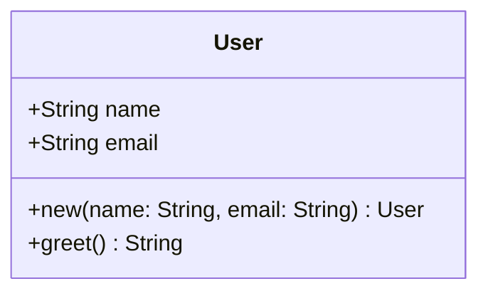

# Auto-UML

<!--toc:start-->
- [Auto-UML](#auto-uml)
  - [Features](#features)
  - [Installation](#installation)
  - [Usage](#usage)
  - [Supported Languages](#supported-languages)
  - [Output](#output)
  - [How It Works](#how-it-works)
  - [Example](#example)
  - [Benchmark](#benchmark)
    - [Test codebases](#test-codebases)
    - [Results](#results)
<!--toc:end-->

An automatic UML diagram generator that uses tree-sitter to parse source code and generate Mermaid class diagrams.

## Features

- **Multi-language support**: Rust, Java, JavaScript, TypeScript, C++, C#
- **Single file analysis**: Generate UML diagrams from individual source files
- **Repository-scale analysis**: Process entire directories and merge diagrams across multiple files
- **Type resolution**: Automatically resolves types across files in multi-file projects
- **Automatic language detection**: Detects the programming language from file extensions

## Installation

```bash
cargo build --release
```

The binary will be at `target/release/auto-uml`.

## Usage

```bash
# Single file mode (language auto-detected)
auto-uml --source-code path/to/file.rs --destination diagram.mmd

# Single file mode with explicit language
auto-uml --lang rust --source-code path/to/file.rs --destination diagram.mmd

# Directory mode (entire repository)
auto-uml --source-code path/to/project --destination diagram.mmd
```

## Supported Languages

| Language    | Extensions        |
|-------------|------------------|
| Rust        | `.rs`            |
| Java        | `.java`          |
| JavaScript  | `.js`            |
| TypeScript  | `.ts`, `.tsx`    |
| C++         | `.cpp`, `.cc`, `.cxx`, `.hpp`, `.h` |
| C#          | `.cs`            |

## Output

The tool generates Mermaid class diagrams. You can render them with:

- [Mermaid Live Editor](https://mermaid.live/)
- VS Code with Mermaid extension
- GitHub Markdown (with mermaid plugin)

## How It Works

1. **Parsing**: Uses tree-sitter to build abstract syntax trees (AST) from source code
2. **Extraction**: Traverses the AST to extract classes, functions, methods, and variables
3. **Stitching**: For multi-file projects, merges diagrams and resolves types across files
4. **Generation**: Outputs Mermaid class diagram format

## Example

Input (Rust):

```rust
struct User {
    name: String,
    email: String,
}

impl User {
    fn new(name: String, email: String) -> User {
        User { name, email }
    }

    fn greet(&self) -> String {
        format!("Hello, {}!", self.name)
    }
}
```

Output (Mermaid):



## Benchmark

Auto-UML is designed from the ground up to be extremely fast. Since it works with a per-file LR representation that is merged recursively it can also work on extremely large code bases. Most codebases can be done in milliseconds with the larger ones taking mere seconds. Making it a great addition to your CI/CD pipeline or personal use.

### Test codebases

All of the following tests were done using hyperfine with 100 runs.

- This Codebase - As is tradition for many analysis programs it is fitting that this program is used to analyze itself. Tests done on version 0.4.1

- [CoreUtils](https://github.com/uutils/coreutils.git) -**14.632** A rust rewite of all of the GNU core utils. As a result it is a rather large code base made up of 1280 files, 610 being rust with 233,223 lines of code total.

- [Chart.js](https://github.com/chartjs/Chart.js) - A popular JavaScript charting library. Contains approximately 200 JavaScript files totaling around 30,000 lines of code. Tests done using the JavaScript parser.

### Results

| Codebase                                                     | Commit                                                                                          | Mean runtime | Standard Deviation | Min     | Max     |
| ------------------------------------------------------------ | ----------------------------------------------------------------------------------------------- | ------------ | ------------------ | ------- | ------- |
| This Codebase (src/)                                         | [b3d5d7](https://github.com/anomalyco/auto-UML/commit/b2d5d7e9e560fa1c5fe4dcf2436a36357c0c548c) | 36.2 ms      | 5.3 ms             | 23.5 ms | 45.6 ms |
| [CoreUtils](https://github.com/uutils/coreutils.git)         | [f336d](https://github.com/uutils/coreutils/commit/f335d14a8368aac01fb27518c29732f0bb8292fe)    | 4.231 s      | 0.069 s            | 4.116 s | 4.413 s |
| [Chart.js](https://github.com/chartjs/Chart.js) (JavaScript) | [a15356](https://github.com/chartjs/Chart.js/commit/a153556861074e827358446ec937555ac58c3d11)   | 1.063 s      | 0.021 s            | 1.021 s | 1.149 s |
