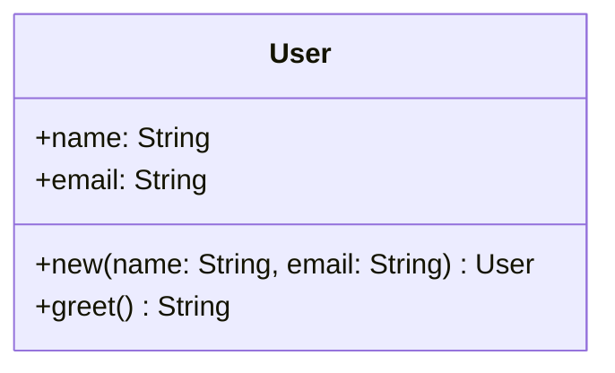

# Auto-UML

<!--toc:start-->
- [Auto-UML](#auto-uml)
  - [Features](#features)
  - [Installation](#installation)
  - [Usage](#usage)
    - [Full Options](#full-options)
  - [Supported Languages](#supported-languages)
  - [Output](#output)
    - [Ignored files](#ignored-files)
  - [How It Works](#how-it-works)
  - [Example](#example)
  - [Benchmark](#benchmark)
    - [Test codebases](#test-codebases)
    - [Results](#results)
<!--toc:end-->

A lightning fast automatic UML diagram generator that uses tree-sitter to parse source code and generate Mermaid or Graphviz class diagrams.

## Features

- **Multi-language support**: Rust, Java, JavaScript, TypeScript, C++, C#, Objective-C, Dart, and Kotlin.
- **Single file analysis**: Generate UML diagrams from individual source files.
- **Repository-scale analysis**: Process entire directories and merge diagrams across multiple files.
- **Remote Analysis**: Clone and analyze remote git repositories directly.
- **Type resolution**: Automatically resolves types across files in multi-file projects.
- **Automatic language detection**: Detects the programming language from file extensions.
- **Multiple output formats**: Mermaid class diagrams or Graphviz DOT, raw or wrapped in a markdown code block.
- **Ignore-aware**: Respects `.gitignore` and other ignore files, so build artifacts and vendored code stay out of the diagram.

## Installation

```fish
cargo install auto-uml
```

Or alternatively to build from source.

```fish
cargo install --git https://github.com/EthanDGee/Auto-UML.git
```

## Usage

```fish
# Analyze current directory (auto-detect language)
auto-uml

# Analyze the current directory with an explicit language
auto-uml --lang rust

# List the languages this build supports
auto-uml --list-languages

# Single file mode (language auto-detected)
auto-uml --source-code path/to/file.rs

# Directory mode (entire repository)
auto-uml --source-code path/to/project

# Remote git repository
auto-uml --git https://github.com/user/repo.git

# Specify destination (Defaults to UML.mmd)
auto-uml --destination my_diagram.mmd

# Wrap the diagram in a markdown code block (writes UML.md)
auto-uml --code-block

# Export Graphviz DOT instead of Mermaid (writes UML.dot)
auto-uml --format graphviz

# Include files that .gitignore and friends would otherwise exclude
auto-uml --no-ignore
```

### Full Options

| Flag | Description |
| ------ | ------------- |
| `--list-languages` | List available programming languages, then exit |
| `-l`, `--lang <LANG>` | Programming language (optional, auto-detected if omitted) |
| `-s`, `--source-code <PATH>` | Path to the local source file or directory [default: current directory]. Mutually exclusive with `--git` |
| `--git <URL>` | Remote git repository URL to clone and analyze |
| `-f`, `--format <FORMAT>` | Output format, `mermaid` or `graphviz` [default: mermaid] |
| `--code-block` | Wraps the output in a markdown code block. Off by default |
| `--no-ignore` | Include files excluded by `.gitignore` and other ignore files |
| `-d`, `--destination <FILE>` | Write destination file [default: `UML.mmd`, or `UML.dot` for graphviz, or `UML.md` with `--code-block`] |

## Supported Languages

| Language    | Extensions                          |
|-------------|-------------------------------------|
| cpp         | `.cpp`, `.cc`, `.cxx`, `.hpp`, `.h` |
| rust        | `.rs`                               |
| java        | `.java`                             |
| javascript  | `.js`                               |
| typescript  | `.ts`, `.tsx`                       |
| csharp      | `.cs`                               |
| objective-c | `.m`, `.h`                          |
| dart        | `.dart`                             |
| kotlin      | `.kt`, `.kts`                       |

## Output

By default the tool writes a Mermaid class diagram as raw text to `UML.mmd`. You can render it with:

- [Mermaid Live Editor](https://mermaid.live/)
- VS Code with Mermaid extension
- GitHub

Pass `--code-block` to wrap the diagram in a markdown fence instead (written to `UML.md`),
which is what GitHub needs to render it inline.

Pass `--format graphviz` for Graphviz DOT (written to `UML.dot`), which you can render with
the `dot` command:

```fish
auto-uml --format graphviz
dot -Tsvg UML.dot -o UML.svg
```

### Ignored files

Files excluded by `.gitignore`, `.ignore`, and other standard ignore files are skipped in
directory mode. Pass `--no-ignore` to include them.

## How It Works

1. **Parsing**: Uses tree-sitter to build a concrete syntax tree (CST) from source code.
2. **Extraction**: Traverses the CST to extract classes, functions, methods, and variables using language specific config.
3. **Stitching**: For multi-file projects, merges diagrams and resolves types across files to create one diagram.
4. **Generation**: Renders the finished diagram as Mermaid or Graphviz DOT, depending on `--format`.

## Example

Input (Rust):

```rust
struct User {
    name: String,
    email: String,
}

impl User {
    fn new(name: String, email: String) -> User {
        User { name, email }
    }

    fn greet(&self) -> String {
        format!("Hello, {}!", self.name)
    }
}
```

Output (Mermaid):


```mermaid
classDiagram
    class User {
        +name: String
        +email: String
        +new(name: String, email: String) User
        +greet() String
    }
```

## Benchmark

Auto-UML is designed from the ground up to be extremely fast. Since it works with a per-file LR representation that is merged recursively it can also work on extremely large code bases. Most code bases can be done in milliseconds with the larger ones taking seconds. Making it a great addition to your CI/CD pipeline or for personal use.

> **Disclaimer**: All benchmarks were performed on the latest main branch as of August 5, 2026.

### Test code bases

All of the following tests were done using hyperfine with 100 runs.

- This Codebase - As is tradition for many analysis programs it is fitting that this program is used to analyze itself.

- [CoreUtils](https://github.com/uutils/coreutils.git) - A rust rewrite of the GNU core utils. As a result it is a rather large code base made up of 1280 files, 610 being rust with 233,223 lines of code total.

- [Chart.js](https://github.com/chartjs/Chart.js) - A popular JavaScript charting library. Contains approximately 200 JavaScript files totaling around 30,000 lines of code. Tests done using the JavaScript parser.

- [BuildCLI](https://github.com/BuildCLI/BuildCLI) - A Java CLI framework. Contains approximately 150 Java files.

- [faker-cxx](https://github.com/cieslarmichal/faker-cxx) - A C++ fake data generator library. Contains approximately 400 C++ files.

- [authpass](https://github.com/authpass/authpass.git) - A Flutter/Dart password manager. Contains approximately 500 Dart files.

- [jupyterlab](https://github.com/jupyterlab/jupyterlab) - A large TypeScript project. Contains approximately 1,000 TypeScript files.

- [bitwarden-server](https://github.com/bitwarden/server) - A large C# project. Contains approximately 1,500 C# files.

- [Platypus](https://github.com/sveinbjornt/Platypus) - An Objective-C macOS application. Contains approximately 30 Objective-C files.

- [ktlint](https://github.com/pinterest/ktlint) - An anti-bikeshedding Kotlin linter with built-in formatter. Contains approximately 400 Kotlin files.

### Results

| Codebase                                                      | Language      | Mean runtime | Standard Deviation | Min       | Max       |
| ------------------------------------------------------------ | ------------- | ------------ | ------------------ | --------- | --------- |
| [This Codebase](https://github.com/anomalyco/auto-UML)      | Rust          | 14.9 ms      | 1.8 ms             | 12.5 ms   | 21.1 ms   |
| [Chart.js](https://github.com/chartjs/Chart.js)             | JavaScript    | 259.2 ms     | 24.5 ms            | 249.3 ms  | 413.1 ms  |
| [CoreUtils](https://github.com/uutils/coreutils.git)         | Rust          | 1.133 s      | 0.057 s            | 1.097 s   | 1.308 s   |
| [BuildCLI](https://github.com/BuildCLI/BuildCLI)            | Java          | 85.1 ms      | 9.7 ms             | 78.1 ms   | 158.3 ms  |
| [faker-cxx](https://github.com/cieslarmichal/faker-cxx)     | C++           | 1.012 s      | 0.054 s            | 0.974 s   | 1.211 s   |
| [authpass](https://github.com/authpass/authpass.git)         | Dart          | 313.3 ms     | 28.3 ms            | 300.5 ms  | 466.0 ms  |
| [jupyterlab](https://github.com/jupyterlab/jupyterlab)       | TypeScript    | 1.352 s      | 0.061 s            | 1.315 s   | 1.520 s   |
| [bitwarden-server](https://github.com/bitwarden/server)     | C#            | 18.298 s     | 0.192 s            | 17.999 s  | 18.947 s  |
| [Platypus](https://github.com/sveinbjornt/Platypus)         | Objective-C   | 291.7 ms     | 23.9 ms            | 283.0 ms  | 433.7 ms  |
| [ktlint](https://github.com/pinterest/ktlint)                 | Kotlin        | 838.0 ms     | 51.3 ms            | 811.9 ms  | 1132.9 ms |
