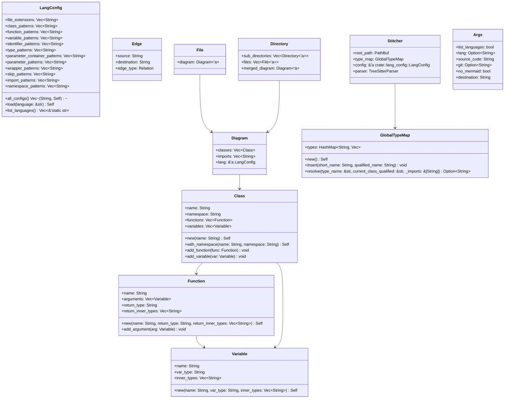

```mermaid
classDiagram
    class LangConfig {
        +file_extensions: Vec~String~
        +class_patterns: Vec~String~
        +function_patterns: Vec~String~
        +variable_patterns: Vec~String~
        +identifier_patterns: Vec~String~
        +type_patterns: Vec~String~
        +parameter_container_patterns: Vec~String~
        +parameter_patterns: Vec~String~
        +wrapper_patterns: Vec~String~
        +skip_patterns: Vec~String~
        +import_patterns: Vec~String~
        +namespace_patterns: Vec~String~
        +all_configs() Vec~(String, Self)~
        +load(language: &str) Self
        +list_languages() Vec~&'static str~
    }
    class Edge {
        +source: String
        +destination: String
        +edge_type: Relation
    }
    class Variable {
        +name: String
        +var_type: String
        +inner_types: Vec~String~
        +new(name: String, var_type: String, inner_types: Vec~String~) Self
    }
    class Function {
        +name: String
        +arguments: Vec~Variable~
        +return_type: String
        +return_inner_types: Vec~String~
        +new(name: String, return_type: String, return_inner_types: Vec~String~) Self
        +add_argument(arg: Variable) void
    }
    class Class {
        +name: String
        +namespace: String
        +functions: Vec~Function~
        +variables: Vec~Variable~
        +new(name: String) Self
        +with_namespace(name: String, namespace: String) Self
        +add_function(func: Function) void
        +add_variable(var: Variable) void
    }
    class Diagram {
        +classes: Vec~Class~
        +imports: Vec~String~
        +lang: &'a LangConfig
    }
    class File {
        +diagram: Diagram~'a~
    }
    class Directory {
        +sub_directories: Vec~Directory<'a>~
        +files: Vec~File<'a>~
        +merged_diagram: Diagram~'a~
    }
    class GlobalTypeMap {
        +types: HashMap~String, Vec<String>~
        +new() Self
        +insert(short_name: String, qualified_name: String) void
        +resolve(type_name: &str, current_class_qualified: &str, _imports: &[String]) Option~String~
    }
    class Stitcher {
        +root_path: PathBuf
        +type_map: GlobalTypeMap
        +config: &'a crate::lang_config::LangConfig
        +parser: TreeSitterParser
    }
    class Args {
        +list_languages: bool
        +lang: Option~String~
        +source_code: String
        +git: Option~String~
        +no_mermaid: bool
        +destination: String
    }
    Function --> Variable
    Class --> Function
    Class --> Variable
    Diagram --> Class
    File --> Diagram
    Directory --> Diagram
    Stitcher --> GlobalTypeMap

```